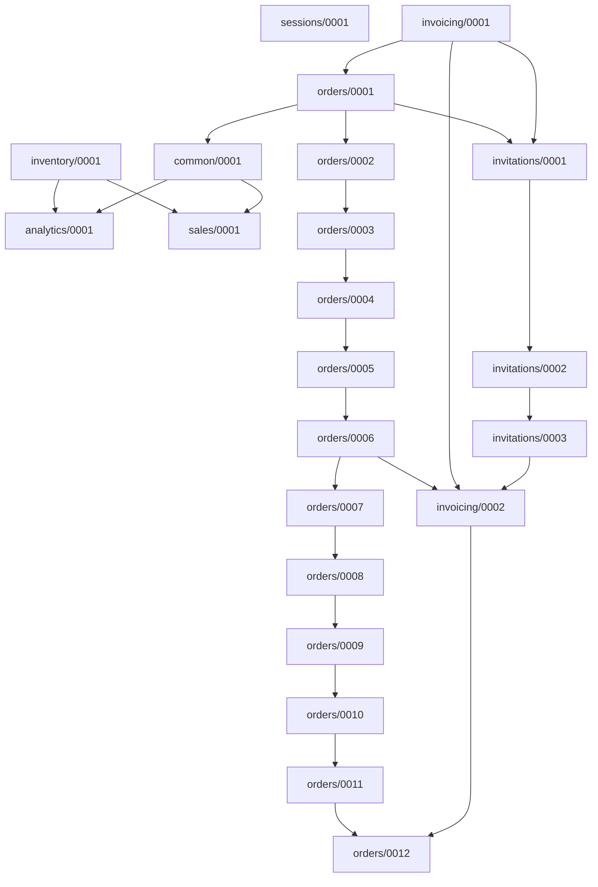

My django project currently has almost 300 models (and another 80-ish 3rd party models), along with some 250 or so migration files from 6 years of development. This is a common situation in long-running Django projects - as your application grows, migrations accumulate, and deploying can take longer and longer.

I wanted to make some quick improvements by squashing a good number of migrations, not to spend a huge amount of time optimizing or fixing broken migrations. So I made sure to thoroughly read the [migrations page](https://docs.djangoproject.com/en/5.1/topics/migrations/) of the django docs to make sure I did things right. Django provides great tools for managing migrations, but squashing migrations in a production SaaS project can be a bit scary 😱.

To make things easy on myself, I thought through how I could minimize the risk.

## Understand the Migration Graph

My first step was to understand how the migrations in my project related to each other. Django's migrations form a graph, but mentally visualizing its structure can be tricky, especially when there are lots of apps and models and relationships all around. So, I used the `migrationgraph` management command from the [django-model-info](https://github.com/OmenApps/django-model-info) package - one of several tools in the package that help in understanding, visualizing, and documenting the models in your Django projects.

```bash
python manage.py migrationgraph
```

This command outputs a detailed listing of all migration dependencies in a project, along with the code for a MermaidJS visual of the dependency graph. You can also filter to specific apps in your project if the resulting output is too large for a single graph. The MermaidJS visual helps us see both direct dependencies (migrations that must be applied before another) and indirect dependencies (migrations that are required through a chain of other migrations).

Here is an example of the output (I cut out the detailed listing to keep it more concise):



Based on this output, we can see that Django's migrations are a [Directed Acyclic Graph (DAG)](https://en.wikipedia.org/wiki/Directed_acyclic_graph). This is crucial because it means:

1. Migrations have a clear order of operations
    
2. There are no circular dependencies
    
3. We can safely squash any linear sequence of migrations without breaking the graph structure
    

## Identify Safe Squashing Candidates

We can easily squash linear paths where each migration depends on only one other, and each migration is a dependent of only one other (excepting the last migration in the linear path, which can have multiple migrations depending on it).

An example might help. Looking at our migration graph, we identified these safe paths to squash:

1. **orders/0002 through orders/0006**: A perfect linear sequence where each migration builds on the previous one
    

```plaintext
0002 → 0003 → 0004 → 0005 → 0006
```

2. **orders/0007 through orders/0011**: Another clean linear sequence
    

```plaintext
0007 → 0008 → 0009 → 0010 → 0011
```

3. **invitations/0002 through invitations/0003**: A smaller but equally safe sequence
    

```plaintext
0002 → 0003
```

### Important Constraints

Some key observations about what we don’t want to include:

* We don't include orders/0001 in our first squash because it has multiple dependencies and dependents. Including it would risk breaking the dependency graph.
    
* We don't include orders/0012 in our second squash because it depends on multiple migrations. This kind of "merge point" in the graph should stay separate to maintain the correct order of operations.
    

These constraints aren't arbitrary - they're important for maintaining the integrity of our project's migration history while also allowing us to easily optimize it. Django will allow you to, for instance, squash from orders/0001 to orders/0012, but you are much more likely to run into serious issues and broken migrations when you try to remove the old squashed migrations files. Then you either have to roll back or do a lot of extra manual editing of migrations - or the database itself!

### Implement the Migration Squashes

After identifying our safe paths for squashing, we can execute the squash process. Let's walk through each step:

#### 1\. Create the Squashed Migrations

For each identified linear path, we run Django's squashmigrations command:

```bash
python manage.py squashmigrations orders 0002 0006
python manage.py squashmigrations orders 0007 0011
python manage.py squashmigrations invitations 0002 0003
```

This creates new migration files with names like:

* `orders/migrations/0002_alter_permission_name_max_length_squashed_0006_require_`[`invoicing.py`](http://invoicing.py)
    
* `orders/migrations/0007_alter_validators_add_error_messages_squashed_0011_update_proxy_`[`permissions.py`](http://permissions.py)
    
* `invitations/migrations/0002_logentry_remove_auto_add_squashed_0003_logentry_add_action_flag_`[`choices.py`](http://choices.py)
    

Each command creates a new migration file that combines the operations from the specified range of migrations.

Django tries to optimizing situations like when one migration adds a field and a following one removes that same field. In this case, the field would simply not be mentioned at all in the resulting squashed migration. Django also automatically handles the internal dependencies and places a `replaces` attribute in the new migrations files that lists all of the migrations this new file supersedes.

```python
class Migration(migrations.Migration):
    replaces = [
        ('orders', '0002_alter_permission_name_max_length'),
        ('orders', '0003_alter_user_email_max_length'),
        # ...
    ]

    dependencies = [
        ('orders', '0001_initial'),
    ]
```

#### 2\. Update Servers

The trickiest part of squashing migrations is ensuring all your production servers are ready for the change. Here's the approach to use:

1. First, deploy the squashed migrations WITHOUT removing any of the original ones:
    
    ```bash
    git add */migrations/*_squashed_*.py
    git commit -m "Add squashed migrations"
    git push origin main
    ```
    
2. Deploy to **all** servers and verify they run the migrations successfully:
    
    ```bash
    python manage.py migrate
    ```
    
    The migrations system will skip over the squashed migrations if the individual migrations they replace have already been applied (this is expected).
    
3. Verify in your database that all the replaced migrations are still marked as applied:
    
    ```sql
    SELECT app, name, applied FROM django_migrations 
    WHERE app IN ('orders', 'invitations')
    ORDER BY app, name;
    ```
    

#### 3\. Update Migration Dependencies

Next, we update any migrations that previously depended on a now-squashed migration. Looking at our dependency graph, here are some examples:

1. `orders/0012_alter_user_first_name_max_length` depends on `orders/0011`
    
    * Update its dependencies to instead point to `0007_alter_validators_add_error_messages_squashed_0011_update_proxy_permissions`
        
2. `invoicing/0002_remove_content_type_name` depends on `invitations/0003`
    
    * Update its dependencies to instead point to `0002_logentry_remove_auto_add_squashed_0003_logentry_add_action_flag_choices`
        

...and so on.

Example of updating a migration's dependencies:

```python
# orders/migrations/0012_alter_user_first_name_max_length.py
dependencies = [
    ('orders', '0007_alter_validators_add_error_messages_squashed_0011_update_proxy_permissions'),  # Updated dependency
]
```

This is just a matter of find/replace for each replaced migration in your system, and is potentially the longest part of this whole process.

#### 4\. Remove the `replaces` Attribute

Once all servers are updated and running the squashed migrations, we can remove the `replaces` attribute from our squashed migrations. This tells Django to treat them as normal migrations:

```python
# Before:
class Migration(migrations.Migration):
    replaces = [
        ('orders', '0002_alter_permission_name_max_length'),
        ('orders', '0003_alter_user_email_max_length'),
        # ...
    ]

    dependencies = [
        ('orders', '0001_initial'),
    ]

# After:
class Migration(migrations.Migration):
    dependencies = [
        ('orders', '0001_initial'),
    ]
```

#### 5\. Clean Up Old Migrations

Finally, we can remove the original migration files that were squashed, and push these changes to the servers:

```bash
# For orders app
rm orders/migrations/0002_alter_permission_name_max_length.py
rm orders/migrations/0003_alter_user_email_max_length.py
rm orders/migrations/0004_alter_user_username_opts.py
rm orders/migrations/0005_alter_user_last_login_null.py
rm orders/migrations/0006_require_invoicing_0002.py

rm orders/migrations/0007_alter_validators_add_error_messages.py
rm orders/migrations/0008_alter_user_username_max_length.py
rm orders/migrations/0009_alter_user_last_name_max_length.py
rm orders/migrations/0010_alter_group_name_max_length.py
rm orders/migrations/0011_update_proxy_permissions.py

# For invitations app
rm invitations/migrations/0002_logentry_remove_auto_add.py
rm invitations/migrations/0003_logentry_add_action_flag_choices.py
```

### Results

After completing this process in our real-world project, our migration count dropped significantly. We were able to replace **113** of our migrations with **15** new squashed migrations. That’s a **reduction of nearly 40% of migrations**! More importantly, we ran into zero issues or hiccups during this process and maintained a working migration history and stable deployments. A couple hours of work to remove almost 100 migrations. If we were to do it again after working through this, it would be much quicker.

### Tips for Squashing

1. Identify linear paths in your migration graph before squashing. The [django-model-info](https://github.com/OmenApps/django-model-info) package can help make this relatively easy.
    
2. Avoid trying to squash migrations that have multiple dependents or dependencies.
    
3. Always deploy squashed migrations to **every** server and run the `migrate` command before removing any original migrations files.
    
4. Be sure to verify each step of the process in a staging environment prior to doing so in production.
    
5. As always, whenever making major changes like this, have backups of each of your servers and **make sure they work BEFORE you make any changes**.
    

---

Hope y'all found this helpful. This approach might take a tiny bit more time than just squashing everything at once, but it's much safer and prevents deployment headaches. And, really, if you’re avoiding issues that may require manually mucking with fixing migrations and your database, isn’t a few extra minutes on the front end well worth it? I think so.